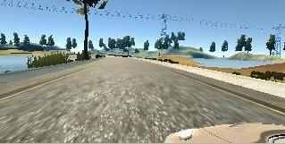
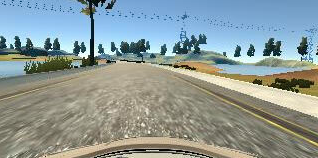
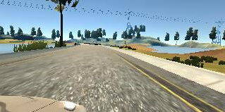
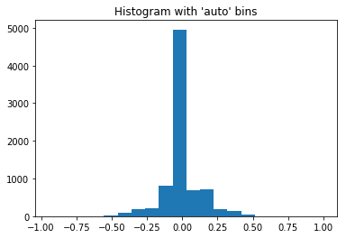
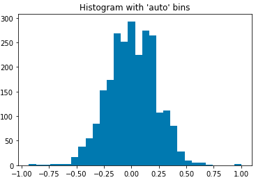
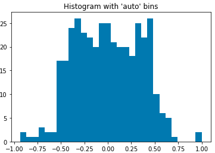

# **Behavioral Cloning**

## Rubric Points
### Here I will consider the [rubric points](https://review.udacity.com/#!/rubrics/432/view) individually and describe how I addressed each point in my implementation.  

---
### Files Submitted & Code Quality

#### 1. Submission includes all required files and can be used to run the simulator in autonomous mode

My project includes the following files:
* model.py containing the script to create and train the model
* random_data.py containing the code to generate randomized data from the sample dataset.  
* drive.py for driving the car in autonomous mode
* model.kasper2.h5 containing a trained convolution neural network
* writeup.md summarizing the results

#### 2. Submission includes functional code
Using the Udacity provided simulator and my drive.py file, the car can be driven autonomously around the track by executing
```sh
python drive.py model.kasper2.h5
```

#### 3. Submission code is usable and readable

The model.py file contains the code for training and saving the convolution neural network. The file shows the pipeline I used for training and validating the model, and it contains comments to explain how the code works. The final model is generated using `kasper2()`

### Model Architecture and Training Strategy

#### 1. An appropriate model architecture has been employed

My model consists of a convolution neural network with 3x3 filter sizes and depths between 32 and 128 (model.py lines 18-24)

The model includes RELU layers to introduce nonlinearity (code line 20), and the data is normalized in the model using a Keras lambda layer (code line 18).

#### 2. Attempts to reduce overfitting in the model

I tried to 

#### 3. Model parameter tuning

The model used an adam optimizer, so the learning rate was not tuned manually (model.py line 25).

#### 4. Appropriate training data
I tried to record my own training data. I find that I am not a good driver. The same model training on my training data is terrible (like it cannot drive straight, drive in circle from the beginning etc). I find that there is a sample training dataset in the symbolic link under the CarND-Behavioral-Cloning-P3/data directory. The result is a much smoother auto driver.
I tried 3 different models on the training data set. All of them failed on the section where there is a dirt patch opening on the road at a sharp turn. I


Training data was chosen to keep the vehicle driving on the road. I used a combination of center lane driving, recovering from the left and right sides of the road ...

For details about how I created the training data, see the next section.

## Model Architecture and Training Strategy

### 1. Solution Design Approach

My first step was to use a convolution neural network model similar to the one described in the course. I choose it because it is fast. When I tested the code, the car immediately drove off the road.

I think it is a better idea to learn from previous successful models.
I googled and found Kasper Sakmann and Jeremy Shannon wrote about his model before.
Jeremy Shannon uses the Nvidia model. First I verified both of the models can drive the car successful in the first track. With this knowledge, my next step is to compare them and see if I can improve the model.
A better model is the one that trains faster and smaller.
Looking at the model print out.

```
Nvidia
_________________________________________________________________
Layer (type)                 Output Shape              Param #   
=================================================================
lambda_2 (Lambda)            (None, 64, 64, 3)         0         
_________________________________________________________________
conv2d_3 (Conv2D)            (None, 30, 30, 24)        1824      
_________________________________________________________________
conv2d_4 (Conv2D)            (None, 13, 13, 36)        21636     
_________________________________________________________________
conv2d_5 (Conv2D)            (None, 5, 5, 48)          43248     
_________________________________________________________________
conv2d_6 (Conv2D)            (None, 3, 3, 64)          27712     
_________________________________________________________________
conv2d_7 (Conv2D)            (None, 1, 1, 64)          36928     
_________________________________________________________________
flatten_2 (Flatten)          (None, 64)                0         
_________________________________________________________________
dense_4 (Dense)              (None, 100)               6500      
_________________________________________________________________
dense_5 (Dense)              (None, 50)                5050      
_________________________________________________________________
dense_6 (Dense)              (None, 10)                510       
_________________________________________________________________
dense_7 (Dense)              (None, 1)                 11        
=================================================================
Total params: 143,419
Trainable params: 143,419
Non-trainable params: 0
```
```
Kasper Sakmann model
_________________________________________________________________
Layer (type)                 Output Shape              Param #   
=================================================================
lambda_3 (Lambda)            (None, 64, 64, 3)         0         
_________________________________________________________________
conv2d_8 (Conv2D)            (None, 16, 16, 32)        6176      
_________________________________________________________________
conv2d_9 (Conv2D)            (None, 4, 4, 64)          131136    
_________________________________________________________________
conv2d_10 (Conv2D)           (None, 2, 2, 128)         131200    
_________________________________________________________________
conv2d_11 (Conv2D)           (None, 2, 2, 128)         65664     
_________________________________________________________________
flatten_3 (Flatten)          (None, 512)               0         
_________________________________________________________________
dropout_2 (Dropout)          (None, 512)               0         
_________________________________________________________________
dense_8 (Dense)              (None, 128)               65664     
_________________________________________________________________
dropout_3 (Dropout)          (None, 128)               0         
_________________________________________________________________
dense_9 (Dense)              (None, 128)               16512     
_________________________________________________________________
dense_10 (Dense)             (None, 1)                 129       
=================================================================
Total params: 416,481
Trainable params: 416,481
Non-trainable params: 0
```

It is clear that the Nvidia model is smaller. But it is deeper.
In my previous project, I find that deeper model produces better result. Therefore, I think Nvidia model is better.

After training the model, I tested both of the models on the first track. None of them can drive through one lap.

Looking at the Nvidia model, I find the model is supposed to work on 66X200 size of image. My input is scaled to 64x64. Therefore, the model needs some modification for it to work. Therefore, I decided to make Kasper model work first.

Looking at the Kasper model, I think it shall work because it is define to handle 64x64 model. I tried to modify the size fo the filter, the strides size and the Dense layers. But non of them has any impact. Finally, without changing the hyperparameters, I tried to remove the two drop out layers. And the car can finish the lap. Looks like the drop out cuts important connections thus making the model work. This makes me think that random drop out may not be a good idea for small models.

The next step for me is to try to reduce the Kasper model to make it simpler. I tried to remove the last layer of conv2d. It did not work at the beginning, after examing the model summary, I think i need to make the out of the third conv2d layer deep but small. Therefore, I increase the strides of the third conv2d layer to (4,4). Here is the summary of the model and it can drive the car through a full lap.

```
Kasper Sakmann model modified
_________________________________________________________________
Layer (type)                 Output Shape              Param #   
=================================================================
lambda_4 (Lambda)            (None, 64, 64, 3)         0         
_________________________________________________________________
conv2d_12 (Conv2D)           (None, 16, 16, 32)        6176      
_________________________________________________________________
conv2d_13 (Conv2D)           (None, 4, 4, 64)          131136    
_________________________________________________________________
conv2d_14 (Conv2D)           (None, 1, 1, 128)         131200    
_________________________________________________________________
flatten_4 (Flatten)          (None, 128)               0         
_________________________________________________________________
dense_11 (Dense)             (None, 128)               16512     
_________________________________________________________________
dense_12 (Dense)             (None, 128)               16512     
_________________________________________________________________
dense_13 (Dense)             (None, 1)                 129       
=================================================================
Total params: 301,665
Trainable params: 301,665
Non-trainable params: 0
```
With this change, cut 1/4 of the parameters and the model is only **36MB**

With this finding, I tried to make the Nvidia model similar structure but deeper. Here is the summary of the model.


### 2. Final Model Architecture

The final model architecture (model.py method kasper2()) consisted of a convolution neural network with the following layers and layer sizes


Here is a visualization of the architecture (note: visualizing the architecture is optional according to the project rubric)

```
Kasper Sakmann model modified
_________________________________________________________________
Layer (type)                 Output Shape              Param #   
=================================================================
lambda_4 (Lambda)            (None, 64, 64, 3)         0         
_________________________________________________________________
conv2d_12 (Conv2D)           (None, 16, 16, 32)        6176      
_________________________________________________________________
conv2d_13 (Conv2D)           (None, 4, 4, 64)          131136    
_________________________________________________________________
conv2d_14 (Conv2D)           (None, 1, 1, 128)         131200    
_________________________________________________________________
flatten_4 (Flatten)          (None, 128)               0         
_________________________________________________________________
dense_11 (Dense)             (None, 128)               16512     
_________________________________________________________________
dense_12 (Dense)             (None, 128)               16512     
_________________________________________________________________
dense_13 (Dense)             (None, 1)                 129       
=================================================================
Total params: 301,665
Trainable params: 301,665
Non-trainable params: 0
```


### 3. Creation of the Training Set & Training Process

My goal of this project is to learn how different model compares with each other. Therefore, I tried to use one set of data. I found that the course provided dataset in `/carnd_p3/data`. Therefore, I want to use this set of data and experiment with different ways of processing the data to make a good training set.

#### Image size and cropping

First, let's take a look at how the sample training image looks like. Here are the views of the same moment from left, center and right.





I can crop the top 50 pixels and bottom 20 pixels out from the image and still get a good view of the road. This approach works for this specific case because the road is flat. But it won't work as well if the road contains a lot of ups and downs.

Then I read the blog from [Kasper Sakmann](https://medium.com/@ksakmann/behavioral-cloning-make-a-car-drive-like-yourself-dc6021152713). Looks like he is able to achieve the goal by using a 64x64 image.

Using small image has the following benefits:
1. smaller training data -- smaller disk space and faster transfer over the network
2. Faster training.
3. Smaller models

Therefore, I decided to use 64x64 as the image

#### Steering data
Because the nature of the driving simulation, I suspect that the steering data is not well distributed. Therefore, I use the following code to visualize the steering data from the dataset. Actual code is in `calculate_steering_keep_rate()` and `normalize_steering_lines()` in `random_data.py`
```
import matplotlib.pyplot as plt
steerings = lines[:,3].astype(np.float)
plt.hist(steerings, bins=30)  # arguments are passed to np.histogram
plt.title("Histogram with 'auto' bins")
plt.show()
```


It is obvious that there are too many samples near 0 steering. This will make the model more likely to stay straight, thus making it harder to survive a sharp turn.

```
hist, bin_edges= np.histogram(steerings,bins=30)
threshold=np.average(hist)
# get the random keep % from the histogram
keep_rate = []
for i in range(len(hist)):
    if (hist[i]>threshold):
        keep_rate.append(threshold/hist[i])
    else:
        keep_rate.append(1)
keep_rate = np.asarray(keep_rate)

# simulate the new histogram with the keep_rate
# lines = np.ndarray.sort(lines)
lines_keep=[]
for i in range(len(lines)):
    h = -1
    for j in range(len(bin_edges)):
        if (bin_edges[j]>= steerings[i]):
            h = j - 1
            break
    if (h!=-1 and np.random.randint(100000) < keep_rate[h] * 100000):
        lines_keep.append(lines[i])
lines_keep=np.asarray(lines_keep)
print(len(lines_keep))
steerings_keep = lines_keep[:,3].astype(np.float)
plt.hist(steerings_keep, bins=30)  # arguments are passed to np.histogram
plt.title("Histogram with 'auto' bins")
plt.show()
```
After running the above code, the histogram has a better distribution. 2446 samples out of 8036 original data points are in the output dataset.



**other things I have tried**

At first, I use median to calculate the threshold.
```
threshold=np.median(hist)
```
This turns out to be a bad idea because the values are too evenly distributed. Therefore, the car sometimes make too big turn and gets out of the road.
Here is how the distribution looks like, only 346 samples out of 8036 oritinal data points are in the output dataset



#### Using left, center and right Images

To increase the amount of data, I utilized the left, center and right images. I use the steering angle calculation from Kasper Sakmann's blog post. Here is his method:
`ignoring perspective distortions one could reason that if the side cameras are about 1.2 meters off-center and the car is supposed to get back to the middle of the road within the next 20 meters the correction to the steering should be about 1.2/20 radians (using tan(𝛼)~𝛼). `

#### Randomize dataset
To make sure the model is generalized enough, I need to randomize the input images.
I use the following methods: flipping, brightness adjustment, affineTransform and cropping.

**Affine Transform **

To simulate different angle of view, I use affine transformation with a target point randomly moved alone the x-axis. See `affineTransform()` in `random_data.py`

**Crop**

To make sure the view of the road is not fixed, I use a random crop to move the cropping region. The image is resized to 64x64. See `crop()` in `random_data.py`

**Flip**

The image is randomly flipped alone the y-axis to make a mirrored view. The steering angle is also mirrored. See `flip()` in `random_data.py`

**Brightness adjustment**
To make the model work with shadows better, the training data brightness are randomly adjusted. See `brightness()` in `random_data.py`

#### Generating training and validation dataset

I use the generator methods described in the course to generate the training and validation set. See `generator()` in `model.py`
